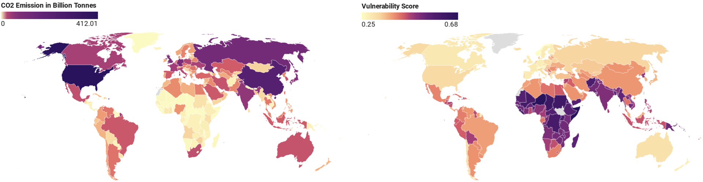
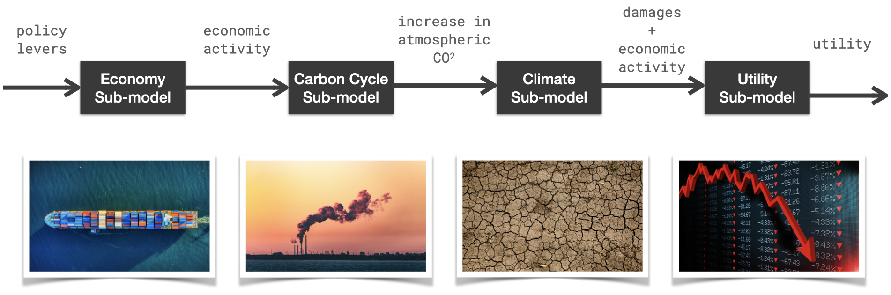
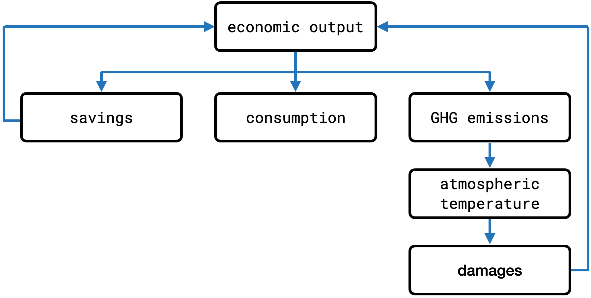
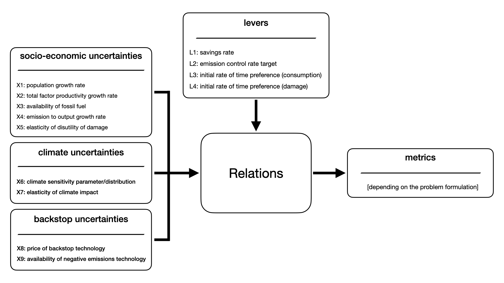
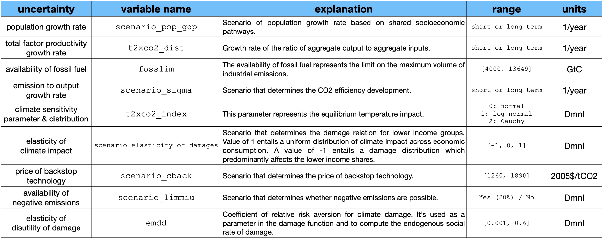
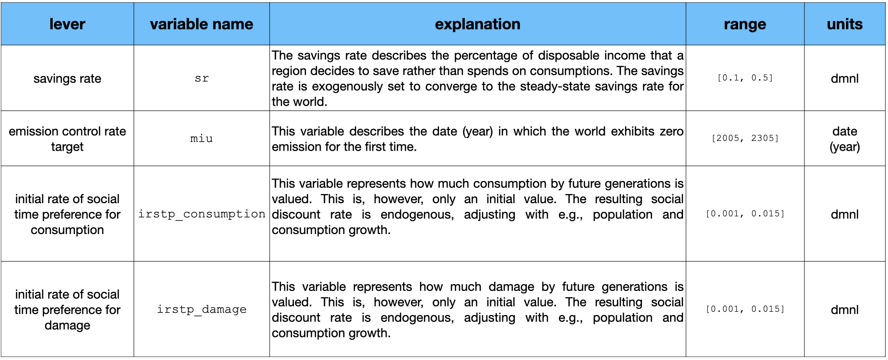
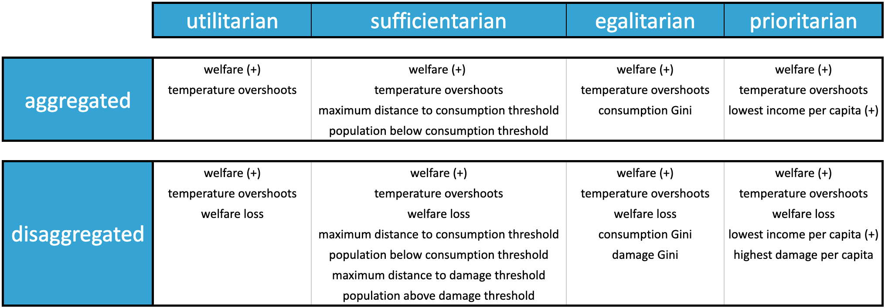
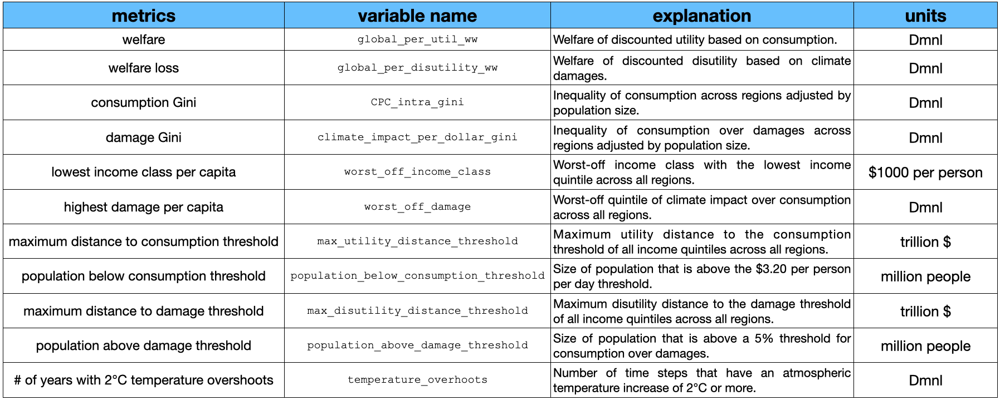

# The PyRICE Model


## Authored by Max Reddel

This is a simulation model implementation of the RICE2010 model by Nordhaus. It is modified in a way, such that alternative ethical problem formulations and the level of aggregation can be selected. The aggregation levels refer whether to disaggregate utility and disutility.

### Ethical Premises
- `utilitarian`
- `sufficientarian`
- `egalitarian`
- `prioritarian`

### Aggregation Levels
- `aggregated`
- `disaggregated`


## Table of Contents
1. [Context](#1-context)
2. [Uncertainty Modules](#2-uncertainty-modules)
3. [Repository Structure](#3-repository-structure)
4. [The PyRICE Model](#4-the-pyrice-model)
   1. [Model Flow](#41-model-flow)
   2. [XLRM](#42-xlrm)
   3. [12 Regions](#43-regions)
5. [Using the Simulation Model](#5-how-to-use-the-pyrice-model)
   1. [Initialization](#51-intialize-the-pyrice-model)
   2. [Run](#52-run-the-pyrice-model)
   3. [Results](#53-view-results)

---

## 1. Context

This project has been developed within a master's thesis at the **TU Delft** during the academic year 2021/22 (Q3 and Q4). It is a continuation of the same author's work during his internship at the **Hippo DAI Lab** at the **TU Delft** during the academic year 2021/22 between (Q1 and Q2). This model is based on the work of Ivar Tjallingii who developed a working version of PyRICE. The initial contribution (during the internship) of Max Reddel lies in refactoring the PyRICE model, such that modularity, object-orientation, and thus reusability are enabled. Ivar's original model can be found in [this repository](https://github.com/itjallingii/PyRICE2020). Further changes with respect to the exact design of the social welfare functions and the disaggregation of utility and disutility have followed during this project.

The topic of **equity in climate change policy** is itself motivated by many international developments and especially the so-called **double inequality** The term \textit{double inequality} which has been coined to describe the inverse relationship of the distributions of risks and responsibilities. Figure 1 shows a visual representation. The left image shows Cumulative CO₂ emissions by Country. The right image shows the vulnerability that measures a country's exposure, sensitivity and ability to adapt to the negative impact of climate change. (The images have been created by Palok Biswas and can be found [here](https://www.datawrapper.de/_/sBfif/) and [here](https://www.datawrapper.de/_/Iy6d0/), respectively.) 


<figcaption align = "center"><b>Fig.1 - Double Inequality </b></figcaption>


---

## 2. Uncertainty Modules
The PyRICE has been connected to the SSP scenarios by aggregating country statistics into 12 RICE regions. Extra climate uncertainties have been added to analyze the expsosure of alternative abatement pathways to deep uncertainty in climate change. To use the uncertainty modules, additional packages need to be installed to connect to the [ema_workbench](https://emaworkbench.readthedocs.io/en/latest/).


---
## 3. Repository Structure

```
./PyRICE_2022/
├── dmdu
│   ├── exploration   
│   │   ├── data                                # resulting data from experiments          
│   │   ├── epsilon_determination.ipynb         
│   │   ├── exploration_damage_gini.ipynb
│   │   ├── exploration_damage_threshold.ipynb
│   │   ├── open_exploration.ipynb
│   │   ├── perform_experiments.py
│   │   └── sensitivity_analysis.ipynb
│   ├── general         
│   │   ├── convergence.py                        
│   │   ├── directed_search.py
│   │   ├── timer.py
│   │   ├── visualization.py                    # functions for data visualization
│   │   └── xlm_constants_epsilons.py           # functions to return X, L, M, epsilon values and constants
│   ├── outputimages                            # images resulting from data visualization
│   │   ├── boxplots
│   │   ├── exploration
│   │   ├── iEMSs
│   │   ├── optimalpolicies
│   │   ├── pathways
│   │   ├── relativemedians
│   │   ├── scenariodiscovery
│   │   ├── seeds
│   │   └── tradeoffs
│   ├── policydiscovery
│   │   ├── analysis
│   │   │   ├── seedanalysis                    # scripts and notebooks for seed analysis
│   │   │   ├── boxplots.ipynb
│   │   │   ├── convergence.ipynb
│   │   │   ├── high_level_pathways.ipynb
│   │   │   ├── iEMSs.ipynb
│   │   │   ├── more_pathways.ipynb
│   │   │   ├── pareto_front.ipynb
│   │   │   ├── pathways.ipynb
│   │   │   ├── pf_median_grids.ipynb
│   │   │   ├── policy_selection.ipynb
│   │   │   ├── regional_pathways.ipynb
│   │   │   ├── robustness.py
│   │   │   ├── robustness_analysis.ipynb
│   │   │   ├── selected_policies.ipynb
│   │   │   └── trade_offs.ipynb
│   │   ├── data                                # data from optimizations and consequent experiments
│   │   ├── paretosorting                       # non-dominated sorting post optimization
│   │   │   ├── data
│   │   │   │   ├── final
│   │   │   │   ├── input
│   │   │   │   └── output
│   │   │   ├── prepare_input.py
│   │   │   ├── prepare_output.ipynb
│   │   │   └── README.md
│   │   ├── directed_policy_search.py
│   │   ├── experimentation.py
│   │   └── seed_experimentation.py
│   └── scenariodiscovery         
│       ├── clustering
│       │   ├── data
│       │   ├── clustering.ipynb
│       │   ├── silhouette_widths.py
│       │   └── worst_scenarios.ipynb
│       ├── search
│       │   ├── data
│       │   ├── convergence.ipynb
│       │   ├── directed_scenario_search.py
│       │   └── worst_scenarios.ipynb
│       └── selection
│           ├── data
│           ├── reference_scenarios.ipynb
│           └── scenario_selection.py
├── examples
│   ├── simulation.ipynb                        # example notebook to run the PyRICE model    
│   └── simulation.py                           # example script to run PyRICE model
├── images                                      # images for md files
├── model                                       # entire model implementation
│   ├── inputdata                   
│   ├── outputdata           
│   ├── submodels                   
│   │   ├── carbon_cycle_model.py     
│   │   ├── climate_model.py          
│   │   ├── economy_model.py         
│   │   └── utility_model.py               
│   ├── data_sets.py                 
│   ├── enumerations                            # Custom enums   
│   ├── model_limits.py                         
│   └── pyrice.py                               # Main model       
├── README.md 
└── requirements.txt         
```

The `model` directory contains all model relevant components, including the main model `pyrice`, its submodels, data sets, etc. You can run the model by using the notebook `simulation.ipynb` which provides a walkthrough the most important parameters, how to run the model, and how to view the results. 

---
## 4. The PyRICE Model

### 4.1 Model Flow 


The model uses four sub-models: `economy_model`, `carbon_cycle_model`, `climate_model`, and `utility_model`. Each is responsible for its own domain. The flow within one time step is depicted below.


<figcaption align = "center"><b>Fig.2 - PyRICE Model Flow</b></figcaption>

This simple representation of the model flow is useful but it obfiscuates the feedback loops within the model. For this purpose, we also want to show the following figure.


<figcaption align = "center"><b>Fig.3 - IAM </b></figcaption>

### 4.2 XLRM 

Within the XLRM framework, the PyRICE model can be represented as seen in the figure 4. 


<figcaption align = "center"><b>Fig.4 - XLRM for PyRICE</b></figcaption>

#### 4.2.1 X: Uncertainties


<figcaption align = "center"><b>Fig.5 - X: Uncertainties </b></figcaption>


#### 4.2.2 L: Levers


<figcaption align = "center"><b>Fig.6 - L: Levers </b></figcaption>


#### 4.2.3 M: Metrics
The metrics depend on the exact problem formulation. There are 8 problem formulations, which is a combination of an ethical premise and an aggregation level. Figure 7 provides an overview.


<figcaption align = "center"><b>Fig.7 - Problem Formulations</b></figcaption>

Each cell in this table represents one problem formulation. A **(+)** after an objective indicates that the desired optimization direction is maximization. The lack of such a symbol indicates minimization as the desired optimization direction.

The individual metrics are listed and explained in Figure 8 below.


<figcaption align = "center"><b>Fig.8 - M: Metrics </b></figcaption>


### 4.3 Regions

The used regions within this PyRICE model are depicted in the following table:

|  RICE Region          | Description                                        |
|-----------------------|----------------------------------------------------|
| `US`                  | The United States of America                       |
| `OECD-Europe`         | European countries that are members of the OECD    |
| `Japan`               | Japan                                              |
| `Russia`              | Russia                                             |
| `Non-Russia Eurasia`  | Countries that are in Eurasia \ {Russia}           |
| `China`               | China                                              |
| `India`               | India                                              |
| `Middle East`         | Middle-Eastern countries                           |
| `Africa`              | Countries of the African continent                 |
| `Latin America`       | Countries of Latin America                         |
| `OHI`                 | Other high income countries                        |
| `Other non-OECD-Asia` | Countries in Asia that are not members of the OECD |

---
## 5 How to Use the PyRICE Model

### 5.1 Intialize the PyRICE Model

The most important parameters are listed below. Use simply **`model = PyRICE()`** with the following parameters.


### Model Parameters

**Bolded** elements are model default values.

| Variable              | Values                                                                                                                                          | Description                                                                                                                               |
|-----------------------|-------------------------------------------------------------------------------------------------------------------------------------------------|-------------------------------------------------------------------------------------------------------------------------------------------|
| `model_specification` | **`ModelSpec.STANDARD`** <br> `ModelSpec.Validation_1` <br> `ModelSpec.Validation_2`                                                            | Standard for simulation and optimizaiton <br> Replicating RICE2010 <br> Deterministic RICE2010                                            |
| `damage_function`     | **`DamageFunction.NORDHAUS`** <br> `DamageFunction.NEWBOLD` <br> `DamageFunction.WEITZMAN`                                                      | Nordhaus + SLR <br> Newbold & Daigneault <br> Weitzman                                                                                    |
| `welfare_function`    | **`WelfareFunction.UTILITARIAN`** <br> `WelfareFunction.EGALITARIAN` <br> `WelfareFunction.SUFFICIENTARIAN` <br> `WelfareFunction.PRIORITARIAN` | Total aggregated utility <br> Equal distribution of risks & benefits <br> People above some threshold  <br> Wellbeing of worst-off region |

### 5.2 Run the PyRICE Model
Next, we can run the model with specific lever values. The most important parameters are listed below. The default values of the lever parameters represent the **original Nordhaus policy**. 

If the model has been initialized with e.g., `model = PyRICE()`, we can simply use the call function `model()` with the parameters below.

### Levers

| Variable            | Values           | Default | Description                                           |
|---------------------|------------------|---------|-------------------------------------------------------|
| `sr`                | `[0.1, 0.5]`     | `0.248` | Savings rate                                          |
| `miu`               | `[2005, 2305]`   | `2135`  | Emission control rate target (year of zero-emission)  |
| `irstp_consumption` | `[0.001, 0.015]` | `0.015` | Initial rate of social time preference of consumption |
| `irstp_damage`      | `[0.001, 0.015]` | `0.015` | Initial rate of social time preference of damage      |


### Miscellaneous Parameters

| Variable    | Values         | Default | Description                                             |
|-------------|----------------|---------|---------------------------------------------------------|
| `precision` | `{10, 20, 30}` | `10`    | Precision of timeseries data of final outcomes in years |


Precision indicates how precise you want your timeseries data to be in the final outcomes. E.g., `10` means, you get a value every 10 years.

### 5.3 View Results

Running the model will return a dictionary containing all outcome variables. This dictionary is handy for conducting further optimization. It is, however, not handy, to inspect the results.

An alternative data structure for this is in form of a `Results` object which is also saved within the model and contains the same information as the dictionary.

With `results = model.get_better_formatted_results()`, you will get this object.

All relevant outcome data is saved into a `results` object and can be accessed via its attributes. Results is an object that contains several pandas dataframes and 3 highly aggregated float variables.

### Results

| Attribute                 | Data Type   | Description                                                                                                                                                                                                                                                                                         |
|---------------------------|-------------|-----------------------------------------------------------------------------------------------------------------------------------------------------------------------------------------------------------------------------------------------------------------------------------------------------|
| `aggregated_utility`      | `float`     | Total aggregated utility                                                                                                                                                                                                                                                                            |
| `aggregated_utility_gini` | `float`     | Total aggregated utility GINI                                                                                                                                                                                                                                                                       |
| `aggregated_impact_gini`  | `float`     | Total aggregated impact GINI                                                                                                                                                                                                                                                                        |
| `df_population`           | `dataframe` | Population over regions over years                                                                                                                                                                                                                                                                  |
| `df_cpc`                  | `dataframe` | Consumption per capita over regions over years                                                                                                                                                                                                                                                      |
| `df_cpc_pre_damage`       | `dataframe` | Pre-damage consumption per capita over regions over years                                                                                                                                                                                                                                           |
| `df_cpc_post_damage`      | `dataframe` | Post-damage consumption per capita over regions over years                                                                                                                                                                                                                                          |
| `df_main`                 | `dataframe` | Over years with following columns: <br> - damages <br> - utility lowest income per capita <br> - highest climate impact per capita <br> - distance to threshold <br> - population under threshold <br> - intratemporal utility GINI <br> - intratemporal impact GINI <br> - atmospheric temperature |


You can also view the attributes in a convenient way with the method `model.view_better_formatted_results()`.


